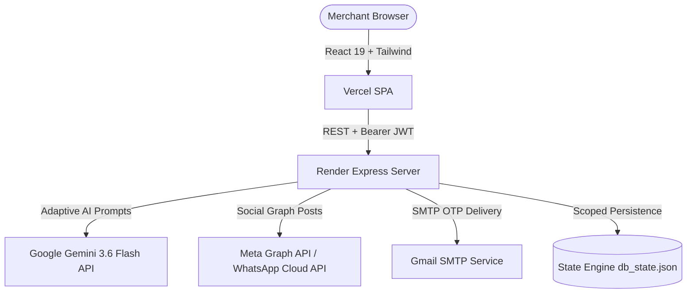

# 📍 AdPulse AI — Hyperlocal Campaign & Multi-Channel Marketing Platform

[](https://vitejs.dev/)
[](https://www.typescriptlang.org/)
[](https://deepmind.google/technologies/gemini/)
[](https://expressjs.com/)
[](https://vercel.com/)

> **An AI-powered hyperlocal marketing copilot designed for local retailers and SMBs.** Calibrated with real-time GPS geofence radius targeting (1–50 KM), regional cultural dialect models (Odia, Hindi, English), multi-channel automated ad dispatching (Facebook, Instagram, WhatsApp, Google Business), and real-time foot-traffic conversion analytics.

---

## 🌐 Live Deployments

- **Frontend Application (Vercel):** [https://hyperlocal-campaign.vercel.app](https://hyperlocal-campaign.vercel.app)
- **Backend API Service (Render):** [https://hyperlocal-campaign.onrender.com](https://hyperlocal-campaign.onrender.com)
- **GitHub Repository:** [https://github.com/Saswata828/Hyperlocal-Campaign](https://github.com/Saswata828/Hyperlocal-Campaign)

---

## 🔑 Demo Access Credentials

To test the platform without completing registration:

| Parameter | Demo Account Credentials |
|:---|:---|
| **Login URL** | Click **"Merchant Sign In"** on the landing page |
| **Email** | `saswatamishra828@gmail.com` |
| **Password** | `123654789` |
| **Store Name** | AdPulse Dev Labs (Bhubaneswar, Odisha) |
| **Active Geofence** | 24 KM perimeter |

*(Alternatively, you can register a new merchant account with your own email — OTP verification is delivered via automated Gmail SMTP).*

---

## 🚀 Key Features

### 1. 🧠 AI Campaign Copilot & Creative Generator
- **Gemini 3.6 Flash Grounded**: Trained on regional retail patterns, local festival calendars (Durga Puja, Diwali, Raja Parba, Dhanteras), and inventory-moving discount triggers.
- **Dialect & Linguistic Localization**: Automatically generates copy in regional Odia, conversational Hindi, and high-converting English.
- **Adaptive Failover Pipeline**: Resilient model routing: `gemini-3.6-flash` &rarr; `gemini-2.5-flash` &rarr; `gemini-2.0-flash`.

### 2. 🎯 Dynamic Geofence Radius Targeting (1–50 KM)
- Interactive radial perimeter slider targeting customers within **1 to 50 KM** of the merchant's physical storefront coordinates.
- Dynamic **AI Guided Suggestions** engine estimating reachable local households, peak foot-traffic delivery windows, and ROI projections.
- Live canvas overlay displaying the localized delivery radius stamp.

### 3. 📲 Multi-Channel Social Broadcasting
- Direct dispatching to **Facebook Pages**, **Instagram Professional Accounts**, **WhatsApp Business Cloud API**, and **Google Business Profiles**.
- AES-256 encrypted credential vault for Meta Graph tokens and Page Access Tokens.
- Automated fallback from graphic photo uploads to text feed posts if media endpoints throttle.

### 4. 📜 Publication Registry & Audit History
- Transparent transaction log tracking status (`SUCCESS`, `FAILED`, `PENDING`), live post IDs, and API response codes.
- One-click **Retry Dispatch** for failed API calls.
- **Safe Record Deletion**: Delete individual publication entries or clear history with a confirmation dialog without affecting live campaigns.

### 5. 📊 Real-Time Foot-Traffic & Campaign Analytics
- Interactive Area & Bar Charts tracking live impressions, clicks, estimated store walk-ins, and ROI.
- Regional demand radar utilizing browser HTML5 Geolocation API.

---

## 🛠️ Architecture & Tech Stack



### Frontend
- **Framework:** React 19 + Vite 6
- **Language:** TypeScript 5
- **Styling:** Vanilla Tailwind CSS + Glassmorphism aesthetic
- **Animations:** Motion (`motion/react`)
- **Icons:** Lucide React

### Backend
- **Runtime:** Node.js (v20+)
- **Server:** Express.js + TSX
- **AI Integration:** `@google/genai` (Gemini 3.6 Flash)
- **Security:** AES-256-CBC token encryption, JWT HMAC-SHA256, CORS origin whitelisting
- **Email Delivery:** Nodemailer with Gmail SMTP SSL

---

## 💻 Local Development Setup

### Prerequisites
- Node.js 18+ installed
- Git installed

### 1. Clone the Repository
```bash
git clone https://github.com/Saswata828/Hyperlocal-Campaign.git
cd Hyperlocal-Campaign
```

### 2. Configure Environment Variables
Create `.env` in `backend/`:
```env
PORT=8080
AUTH_MODE="development"
GEMINI_API_KEY="your-gemini-api-key"
JWT_SECRET_KEY="your-random-32-byte-secret"
GOOGLE_CLIENT_ID="your-google-client-id"
GOOGLE_CLIENT_SECRET="your-google-client-secret"
```

Create `.env` in `frontend/`:
```env
VITE_APP_URL="http://localhost:5173"
VITE_API_BASE_URL="http://localhost:8080/api"
VITE_GOOGLE_CLIENT_ID="your-google-client-id"
```

### 3. Install Dependencies & Run
**Backend:**
```bash
cd backend
npm install
npm run dev
```

**Frontend (in a separate terminal):**
```bash
cd frontend
npm install
npm run dev
```
Open **http://localhost:5173** in your browser.

---

## 📄 License
This project is licensed under the MIT License — open-source for educational and commercial local retail empowerment.
